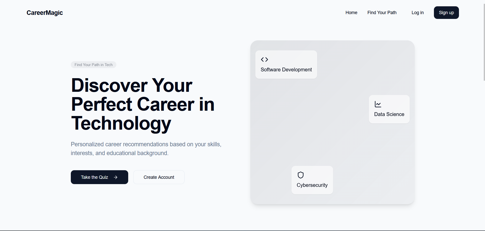
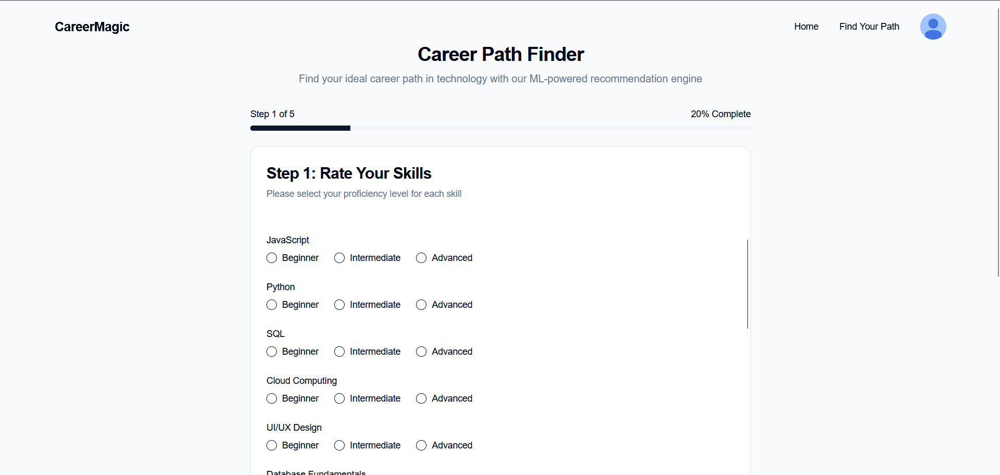

# 🎯 Career Counsellor — React + TypeScript + Rule-Based Engine

<div align="center">


**A smart career guidance platform that provides personalized career recommendations using rule-based decision making and comprehensive career data.**

</div>

---

## 🖼️ Preview

| Home | Dashboard | Quiz Page |
|------|-----------|-----------|
|  |  |  |

---

## ✨ Overview

The **Career Counsellor** is a modern web application that leverages **rule-based algorithms and comprehensive career datasets** to provide personalized career guidance, skill assessments, and career roadmaps. It helps users discover suitable career paths based on their interests, skills, and goals through intelligent data matching.

This project demonstrates:
- Rule-based decision making with JSON data structures
- Modern React development with TypeScript
- Responsive UI design with TailwindCSS
- Data-driven career recommendations
- Interactive career assessment tools

---

## 🚀 Core Features

### 🎯 Smart Career Matching
- Personalized career recommendations using rule-based algorithms
- Skill gap analysis and improvement suggestions
- Industry trend insights based on current data
- Comprehensive career compatibility scoring

### 📊 Career Assessment Tools
- Comprehensive skills and interest assessment
- Personality and aptitude evaluation
- Multi-dimensional career matching
- Weighted scoring system

### 🗺️ Career Roadmapping
- Step-by-step career development plans
- Learning path recommendations
- Certification and course suggestions
- Timeline-based goal setting

### 🎨 Modern UI/UX
- Built with **React + TypeScript + TailwindCSS**
- Fully responsive design (Desktop → Mobile)
- Interactive progress visualizations
- Smooth animations and modern components

---

## 🏗️ Architecture

```

┌────────────────────────────────────────────┐
│                 Client Layer               │
├────────────────────────────────────────────┤
│ React 18 │ TypeScript │ Tailwind CSS │ Vite │
│ Components • Hooks • Context • Pages       │
└────────────────────────────────────────────┘
│
┌────────────────────────────────────────────┐
│             Business Logic Layer           │
├────────────────────────────────────────────┤
│ Rule Engine │ JSON Datasets │ Algorithms   │
│ Career Matching • Skill Analysis • Scoring │
└────────────────────────────────────────────┘
│
┌────────────────────────────────────────────┐
│               Data Layer                   │
├────────────────────────────────────────────┤
│ Career Databases │ Skill Trees │ Roadmaps  │
│ Industry Data • Salary Info • Requirements │
└────────────────────────────────────────────┘

```

---

## 🧮 Tech Stack

| Layer | Technology | Description |
|:------|:------------|:-------------|
| **Frontend** | React + TypeScript | Type-safe component-based UI development |
| **Styling** | Tailwind CSS | Utility-first responsive framework |
| **Build Tool** | Vite | Fast development and building |
| **Data Processing** | Custom Algorithms | Rule-based career matching logic |
| **State Management** | React Hooks + Context | Local state management |
| **Data Storage** | JSON Databases | Structured career and skill data |
| **Icons** | Lucide React | Modern icon library |

---

## 📁 Folder Structure

```

Career-Counseller/
├── public/                    # Static assets
│   ├── home.png
│   ├── dashboard.png
│   ├── quiz.png
│   ├── vite.svg
│   └── react.svg
├── src/
│   ├── components/            # Reusable UI components
│   │   ├── ui/               # Base UI components (Button, Card, etc.)
│   │   ├── assessment/       # Career assessment components
│   │   ├── results/          # Results display components
│   │   └── common/           # Shared components
│   ├── hooks/                # Custom React hooks
│   │   ├── useCareerAssessment.ts
│   │   ├── useLocalStorage.ts
│   │   └── useCareerData.ts
│   ├── pages/                # Main application pages
│   │   ├── Home.tsx
│   │   ├── Assessment.tsx
│   │   ├── Results.tsx
│   │   └── Roadmap.tsx
│   ├── data/                 # Career datasets and rules
│   │   ├── careers.json      # Career database
│   │   ├── skills.json       # Skills taxonomy
│   │   ├── questions.json    # Assessment questions
│   │   └── rules.json        # Matching rules
│   ├── types/                # TypeScript type definitions
│   │   ├── career.ts
│   │   ├── assessment.ts
│   │   └── results.ts
│   ├── utils/                # Utility functions
│   │   ├── careerMatcher.ts  # Rule-based matching engine
│   │   ├── assessmentCalculator.ts
│   │   └── formatters.ts
│   ├── App.tsx               # Root application component
│   ├── main.tsx              # Application entry point
│   └── index.css             # Global styles and Tailwind imports
├── package.json
├── tailwind.config.js        # Tailwind CSS configuration
├── tsconfig.json             # TypeScript configuration
└── vite.config.ts           # Vite configuration

```

---

## ⚙️ Setup & Installation

### 🧩 Prerequisites
- Node.js ≥ 16  
- npm or yarn  

### 🔧 Installation Steps

```bash
# 1️⃣ Clone the repository
git clone https://github.com/KAquib24/Career-Counseller.git
cd Career-Counseller

# 2️⃣ Install dependencies
npm install

# 3️⃣ Start the development server
npm run dev
```

### 🚀 Run the Application

```bash
# Start development server
npm run dev

# Build for production
npm run build

# Preview production build
npm run preview
```

> App will run at **[http://localhost:5173](http://localhost:5173)**

---

## 🎯 How It Works

### 1. **Career Assessment**
- Users complete a comprehensive assessment questionnaire
- Covers skills, interests, personality traits, and career goals
- Uses weighted scoring algorithms based on predefined rules

### 2. **Rule-Based Analysis**
- Assessment data processed through rule-based matching engine
- Compares user profile with comprehensive career database
- Applies scoring algorithms to find best career matches

### 3. **Results & Roadmaps**
- Detailed career compatibility reports
- Skill gap analysis and improvement plans
- Step-by-step career development roadmaps

---

## 🔧 Rule-Based Engine

### Career Matching Algorithm

```typescript
// Example rule-based matching
const calculateCareerMatch = (userProfile: UserProfile, career: Career) => {
  let score = 0;
  
  // Skill matching
  score += calculateSkillMatch(userProfile.skills, career.requiredSkills);
  
  // Interest alignment
  score += calculateInterestMatch(userProfile.interests, career.relatedInterests);
  
  // Personality fit
  score += calculatePersonalityMatch(userProfile.personality, career.idealPersonality);
  
  // Market factors
  score += calculateMarketMatch(career.growthPotential, career.salaryRange);
  
  return normalizeScore(score);
};
```

---

## 🚀 Core Features Detail

### 🎯 Intelligent Career Matching
- **Skill-based matching**: Matches user skills with career requirements
- **Interest alignment**: Aligns personal interests with career options
- **Market relevance**: Considers current job market trends
- **Growth potential**: Evaluates career growth and earning potential

### 📈 Data-Driven Insights
- Comprehensive career database
- Real-time industry statistics
- Salary benchmarks and trends
- Skill requirement analysis

### 🗺️ Structured Roadmaps
- Clear learning pathways
- Certification recommendations
- Timeline planning
- Milestone tracking

---

## 📊 Data Structure

### Career Database Example
```json
{
  "careers": [
    {
      "id": "software-engineer",
      "title": "Software Engineer",
      "category": "Technology",
      "requiredSkills": ["programming", "problem-solving", "algorithms"],
      "relatedInterests": ["technology", "innovation", "coding"],
      "growthPotential": "high",
      "salaryRange": {"entry": 60000, "senior": 120000},
      "roadmap": ["Learn programming basics", "Build projects", "Learn frameworks"]
    }
  ]
}
```

---

## 🎯 Future Enhancements

* 🔄 **User Authentication & Profiles** - Save assessment history and progress
* 📱 **Mobile App** - React Native version for mobile devices
* 🎓 **Educational Integration** - Connect with online learning platforms
* 🤝 **Mentor Matching** - Connect with industry professionals
* 📊 **Advanced Analytics** - Detailed career analytics dashboard
* 🌍 **Multi-language Support** - Support for multiple languages
* 💼 **Job Market Integration** - Real-time job market data

---

## 🧠 Learning Goals

This project demonstrates:

* **Rule-Based Systems**: Implementing intelligent decision making without AI
* **TypeScript Mastery**: Full type safety across the application
* **Modern React Patterns**: Hooks, Context, and component composition
* **Responsive Design**: Mobile-first approach with TailwindCSS
* **Data Structures**: Efficient career data organization and querying
* **User Experience**: Intuitive career assessment flow

---

## 🛠️ Development

### Code Structure
- **Modular Components**: Reusable and maintainable code structure
- **Type Safety**: Comprehensive TypeScript implementation
- **Custom Hooks**: Abstracted business logic for reusability
- **Utility Functions**: Helper functions for common operations

### Performance Optimizations
- **Lazy Loading**: Code splitting for better performance
- **Memoization**: Optimized re-renders with React.memo and useMemo
- **Efficient Data Processing**: Optimized rule-based algorithms

---

## 🧾 License

This project is licensed under the **MIT License**.
See [LICENSE](LICENSE) for details.

---

## ✉️ Contact

**👨‍💻 Aquib Khan**
📧 [aquibkhan8108@gmail.com](mailto:aquibkhan8108@gmail.com)
🔗 [GitHub — @KAquib24](https://github.com/KAquib24)
🔗 [LinkedIn](https://linkedin.com/in/aquib-khan-24)

---

<div align="center">

⭐ **If you find this project helpful, give it a star on GitHub!** ⭐
*"Your career journey deserves smart, data-driven guidance."*

**🚀 Built with structured data and intelligent rule-based systems**

</div>
